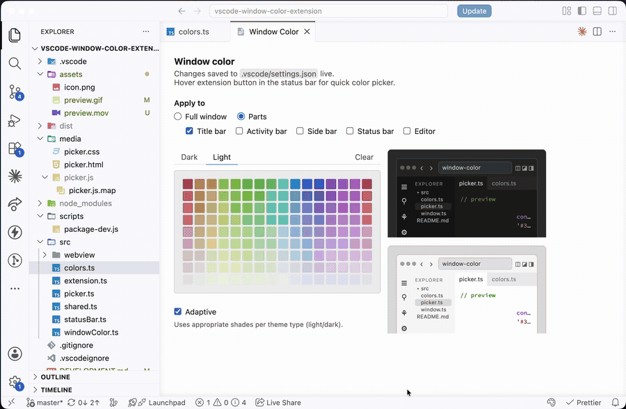
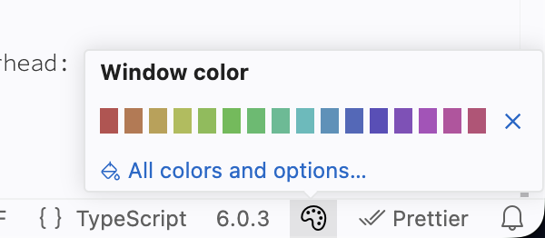

# Window Color

Give every project window its own color, so you can tell them apart at a glance.

Pick a color and the window is tinted immediately — title bar, activity bar, side bar, status bar, editor, or any combination. The choice is saved to the project's `.vscode/settings.json`.

It can automatically adjust color to light or dark theme.

Quick picker available in hover popup for the extension button in the status bar. Hover time depends on your VSCode settings.

## Commands

| Command                            | Description                                                         |
| ---------------------------------- | ------------------------------------------------------------------- |
| `Window Color: Set Window Color…`  | Open the picker.                                                    |
| `Window Color: Clear Window Color` | Remove the colors this extension wrote, without opening the picker. |

## What gets colored

| Part             | Covers                                                         |
| ---------------- | -------------------------------------------------------------- |
| **Title bar**    | Title bar and the command center pill showing the project name |
| **Activity bar** | The icon strip along the window edge                           |
| **Side bar**     | The panel body next to it — explorer, search, source control   |
| **Status bar**   | The bar along the bottom                                       |
| **Editor**       | Editor, tabs, panel and terminal                               |

The activity bar and side bar toggle independently, so you can tint the icon
strip alone and leave the explorer as your theme has it.

**Editor** is deliberately subtle: its surfaces are mixed 90% toward your theme's
own background, because a saturated editor background wrecks syntax-highlighting
contrast. Every other part uses your color at full strength.

## Dark and light themes

If you switch themes through the day, one color rarely suits both — a deep red
that reads well on a dark theme turns muddy on a light one.

**Adaptive**, under the swatch grid, is on by default. Picking a swatch also
claims its counterpart at the same position in the other tab: choose the dark
red from the **Dark** tab and you get the light red from the **Light** tab for
light themes, automatically. The panel shows both, and the window repaints
whenever you switch themes.

This works by theme _kind_, not by theme name, so any dark theme gets the dark
color and any light theme gets the light one — including themes you install
later. High-contrast dark counts as dark.
